# EduTrack - Learning Management System

## Overview

EduTrack is a Flask-based Learning Management System (LMS) designed to manage users, courses, assignments, and submissions. The system supports role-based access for students and instructors, enabling assignment creation, submission, and grading.


## Features

* User Management (Students & Instructors)
* Course Creation and Enrollment
* Assignment Creation with Instructions
* Assignment Submission (Text-based answers)
* Instructor Grading System
* Search Functionality (Users & Courses)
* Role-Based Access Control


## Technologies Used

* Python (Flask Framework)
* SQLite Database
* HTML, CSS (Jinja2 Templates)


## Installation

1. Clone the repository:

```bash
git clone https://github.com/ReddySrujana/EduTrack.git
cd EduTrack
```

2. Install dependencies:

```bash
pip install flask
```

3. Run the application:

```bash
python app.py
```

4. Open browser:

```
http://127.0.0.1:5000/
```

## Screenshots

### 1. Home Page

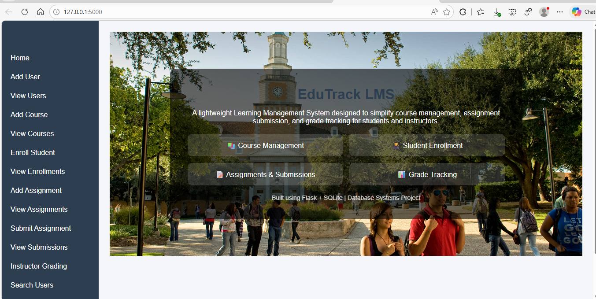


### 2. Add User

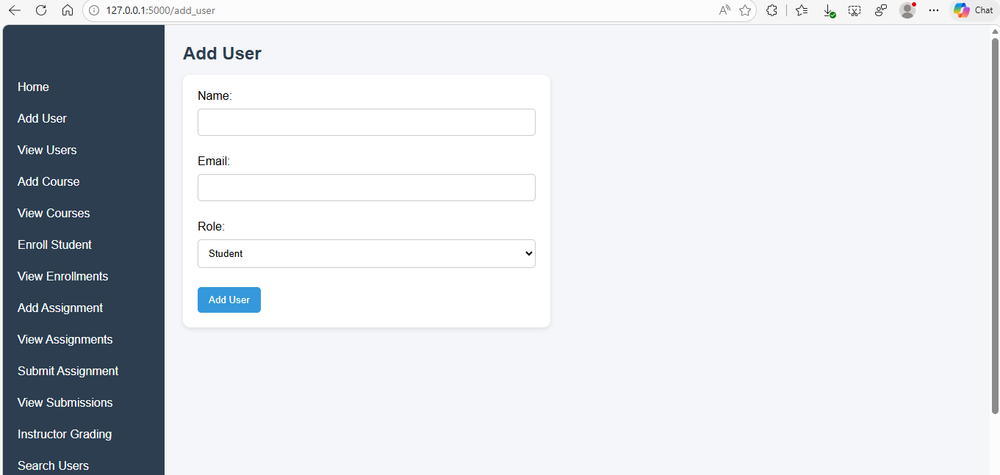


### 3. Users List

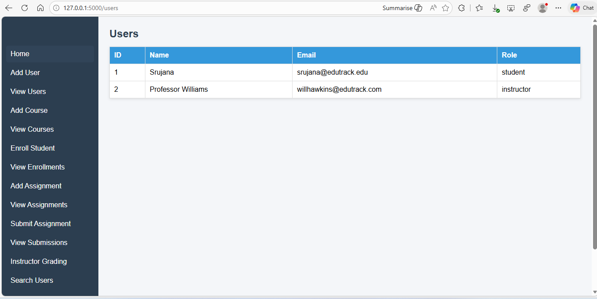


### 4. Add Course

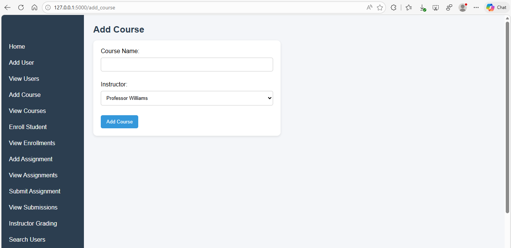


### 5. Courses List

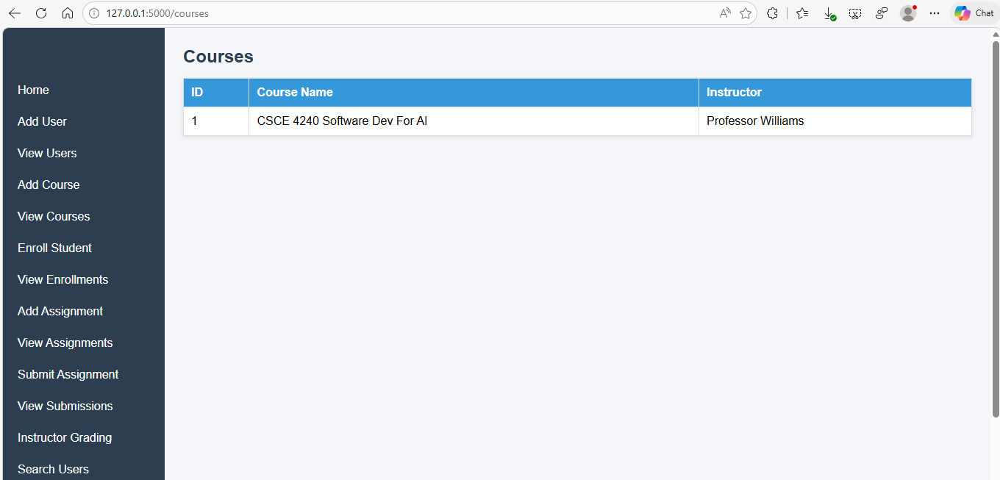


### 6. Add Assignment

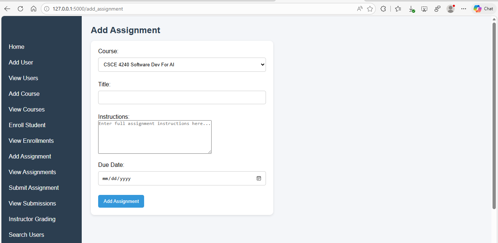


### 7. Assignments List

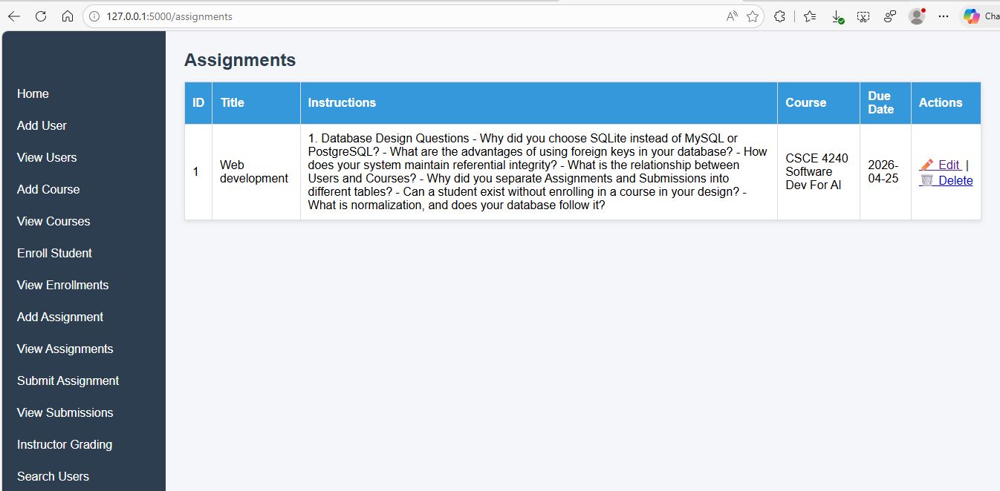


### 8. Submit Assignment

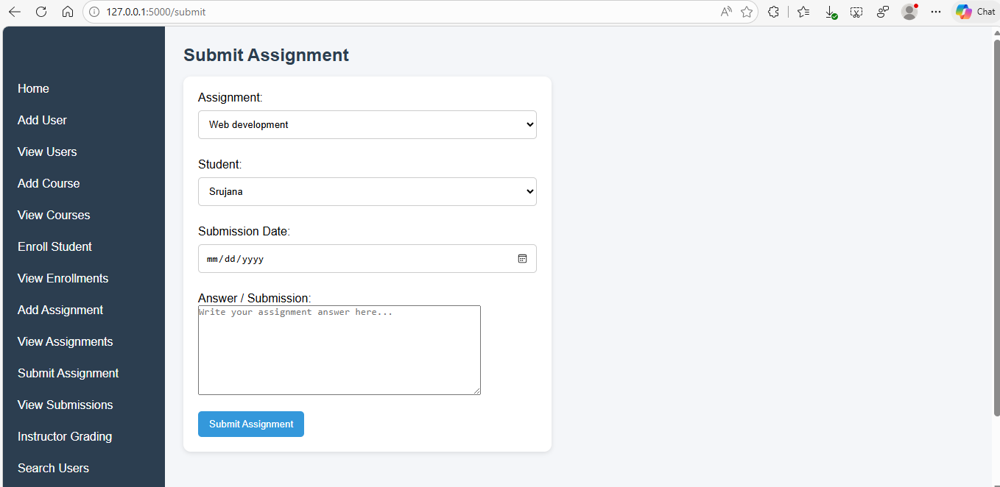


### 9. Submissions View

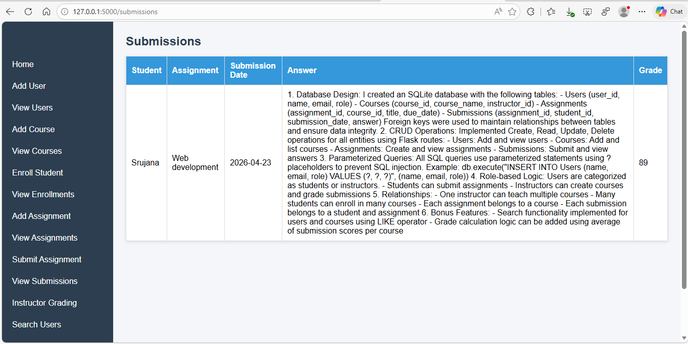


### 10. Instructor Login

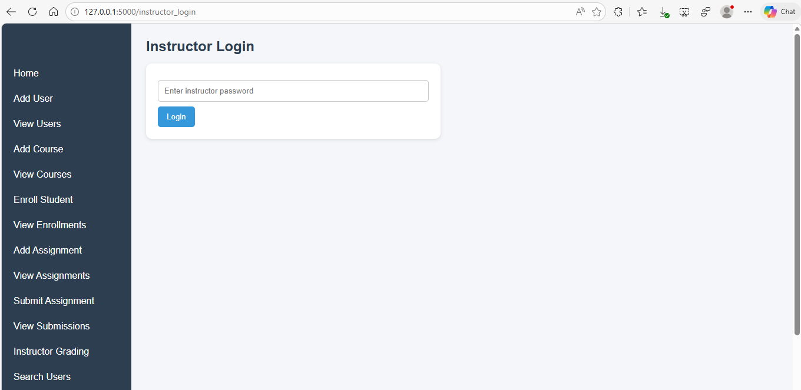


### 11. Grade Assignments

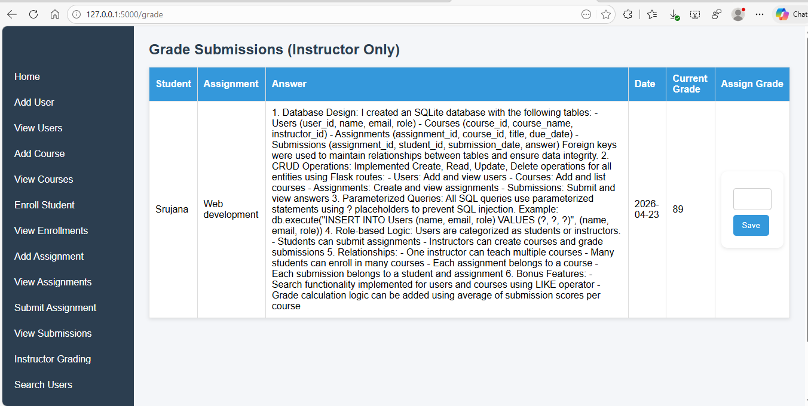


## Usage

* Instructors:

  * Create courses
  * Add assignments
  * Grade submissions (via login)

* Students:

  * Enroll in courses
  * Submit assignments

## Instructor Access

To access grading:

```
Password: instructor123
```


## Future Improvements

* Full authentication system (login/signup)
* File upload submissions
* Dashboard analytics
* Deployment (Heroku/AWS)
